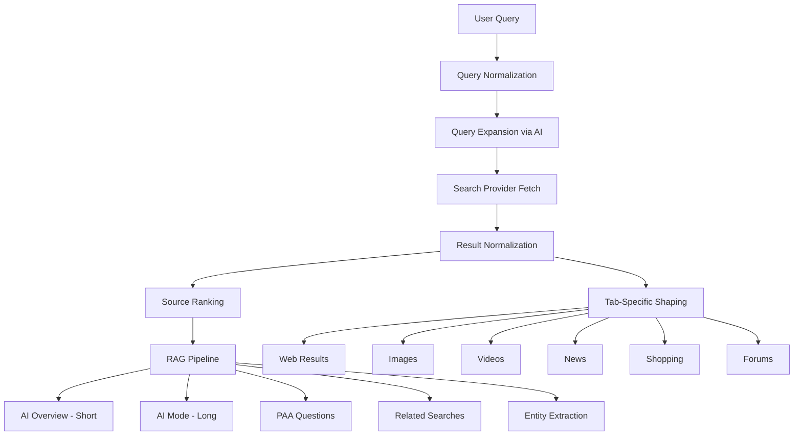

# NovaMind — AI-Powered Search Engine

A production-grade AI search engine combining Google Search UX with Perplexity-style RAG answers.

## Architecture Overview



## Tech Stack

| Layer | Technology |
|-------|-----------|
| Framework | Next.js 15 (App Router) |
| Language | TypeScript |
| Styling | Tailwind CSS (user-requested) |
| UI Components | Custom components (shadcn-inspired patterns) |
| State | React Context + URL params |
| AI Providers | OpenAI / Anthropic / Gemini (abstracted) |
| Search Providers | Tavily / SerpAPI / Brave / Mock (abstracted) |
| Fonts | Inter (Google Fonts) |

## User Review Required

> [!IMPORTANT]
> **Tailwind CSS**: You explicitly requested Tailwind. I'll use Tailwind CSS v4 (bundled with latest `create-next-app`).

> [!IMPORTANT]
> **No Database Initially**: I'll skip PostgreSQL/Prisma and Redis to keep the initial build focused. The architecture is designed so DB layers can be added later. Search history will use localStorage.

> [!IMPORTANT]
> **Mock Mode by Default**: The app will ship with a realistic mock provider so it works out of the box without API keys. Real providers (Tavily, OpenAI, etc.) activate when env vars are set.

---

## Proposed Changes

### Project Initialization

#### [NEW] Next.js Project
- `npx create-next-app@latest ./ --ts --tailwind --eslint --app --turbopack --import-alias "@/*"`
- Install additional deps: `lucide-react`, `clsx`, `tailwind-merge`, `react-markdown`, `remark-gfm`

---

### Core Types (`/src/types/`)

#### [NEW] [search.ts](file:///Users/anshumdev/Desktop/search%20engine/src/types/search.ts)
All TypeScript interfaces: `SearchResult`, `AIOverview`, `AIFullAnswer`, `Citation`, `FAQItem`, `RelatedSearch`, `KnowledgeEntity`, `ImageResult`, `ProductResult`, `NewsResult`, `VideoResult`, `ForumResult`, `SearchResponse`, `ChatMessage`

---

### Provider Abstraction (`/src/providers/`)

#### [NEW] [search/index.ts](file:///Users/anshumdev/Desktop/search%20engine/src/providers/search/index.ts)
Search provider interface + factory. Selects provider based on env vars.

#### [NEW] [search/mock.ts](file:///Users/anshumdev/Desktop/search%20engine/src/providers/search/mock.ts)
Mock search provider with realistic fake data for all tabs.

#### [NEW] [search/tavily.ts](file:///Users/anshumdev/Desktop/search%20engine/src/providers/search/tavily.ts)
Real Tavily API integration.

#### [NEW] [ai/index.ts](file:///Users/anshumdev/Desktop/search%20engine/src/providers/ai/index.ts)
AI provider interface + factory.

#### [NEW] [ai/mock.ts](file:///Users/anshumdev/Desktop/search%20engine/src/providers/ai/mock.ts)
Mock AI provider with realistic responses.

#### [NEW] [ai/openai.ts](file:///Users/anshumdev/Desktop/search%20engine/src/providers/ai/openai.ts)
OpenAI adapter.

---

### Backend Services (`/src/services/`)

#### [NEW] [ragPipeline.ts](file:///Users/anshumdev/Desktop/search%20engine/src/services/ragPipeline.ts)
Main RAG orchestrator: query → search → rank → AI summarize → structured response.

#### [NEW] [queryExpansion.ts](file:///Users/anshumdev/Desktop/search%20engine/src/services/queryExpansion.ts)
Generate query variations using AI for better search coverage.

#### [NEW] [ranking.ts](file:///Users/anshumdev/Desktop/search%20engine/src/services/ranking.ts)
Source ranking by relevance, domain credibility, freshness.

#### [NEW] [citationBuilder.ts](file:///Users/anshumdev/Desktop/search%20engine/src/services/citationBuilder.ts)
Map AI answer citations to source URLs.

#### [NEW] [entityResolver.ts](file:///Users/anshumdev/Desktop/search%20engine/src/services/entityResolver.ts)
Extract knowledge panel entity from search results.

#### [NEW] [resultNormalizer.ts](file:///Users/anshumdev/Desktop/search%20engine/src/services/resultNormalizer.ts)
Normalize raw provider results into unified types.

---

### API Routes (`/src/app/api/`)

#### [NEW] [search/route.ts](file:///Users/anshumdev/Desktop/search%20engine/src/app/api/search/route.ts)
`GET /api/search?q=&tab=` — Main search endpoint returning web results, AI overview, PAA, related searches.

#### [NEW] [ai/route.ts](file:///Users/anshumdev/Desktop/search%20engine/src/app/api/ai/route.ts)
`GET /api/ai?q=` — Full AI Mode answer with streaming support.

#### [NEW] [suggest/route.ts](file:///Users/anshumdev/Desktop/search%20engine/src/app/api/suggest/route.ts)
`GET /api/suggest?q=` — Query suggestions.

---

### Frontend Components (`/src/components/`)

#### Layout & Navigation
- [NEW] `SearchInput.tsx` — Main search bar with suggestions dropdown
- [NEW] `TabsBar.tsx` — Search tabs (All, AI Mode, Images, etc.)
- [NEW] `Header.tsx` — Sticky header for results page

#### AI Components
- [NEW] `AIOverviewCard.tsx` — Gradient card with short AI answer + source chips
- [NEW] `AIModeFull.tsx` — Full AI Mode with structured answer + inline citations
- [NEW] `SourceChips.tsx` — Clickable source pills
- [NEW] `CitationList.tsx` — Numbered source references

#### Search Results
- [NEW] `SearchResultsList.tsx` — Web results container
- [NEW] `SearchResultItem.tsx` — Individual result (favicon, title, URL, snippet)
- [NEW] `PeopleAlsoAsk.tsx` — Expandable FAQ accordion
- [NEW] `RelatedSearches.tsx` — Related query suggestions grid
- [NEW] `KnowledgePanel.tsx` — Right sidebar entity card

#### Tab Content
- [NEW] `ImageGrid.tsx` — Masonry image grid with modal
- [NEW] `ShoppingGrid.tsx` — Product cards grid
- [NEW] `NewsList.tsx` — News cards
- [NEW] `VideoList.tsx` — Video result cards
- [NEW] `ForumsList.tsx` — Discussion/forum results

#### Shared
- [NEW] `LoadingSkeleton.tsx` — Skeleton loaders for all states
- [NEW] `ErrorState.tsx` — Error display
- [NEW] `EmptyState.tsx` — No results state

---

### Pages (`/src/app/`)

#### [NEW] [page.tsx](file:///Users/anshumdev/Desktop/search%20engine/src/app/page.tsx)
Homepage — Google-like minimal design with centered logo + search bar.

#### [NEW] [search/page.tsx](file:///Users/anshumdev/Desktop/search%20engine/src/app/search/page.tsx)
Search results page — Sticky header, tabs, results + sidebar layout.

#### [NEW] [layout.tsx](file:///Users/anshumdev/Desktop/search%20engine/src/app/layout.tsx)
Root layout with Inter font, metadata, dark mode support.

---

### Configuration

#### [NEW] [.env.example](file:///Users/anshumdev/Desktop/search%20engine/.env.example)
```
# Search Provider (leave empty for mock mode)
TAVILY_API_KEY=
SERPAPI_API_KEY=
BRAVE_SEARCH_API_KEY=

# AI Provider (leave empty for mock mode)
OPENAI_API_KEY=
ANTHROPIC_API_KEY=
GOOGLE_AI_API_KEY=

# Provider Selection
SEARCH_PROVIDER=mock  # mock | tavily | serpapi | brave
AI_PROVIDER=mock      # mock | openai | anthropic | gemini
```

---

## Implementation Steps

| Step | Description | Files |
|------|------------|-------|
| 1 | Initialize Next.js project | Root config files |
| 2 | Define all TypeScript types | `src/types/` |
| 3 | Build provider abstraction layers | `src/providers/` |
| 4 | Build backend services (RAG pipeline) | `src/services/` |
| 5 | Create API routes | `src/app/api/` |
| 6 | Build shared UI components | `src/components/shared/` |
| 7 | Build search result components | `src/components/search/` |
| 8 | Build AI components | `src/components/ai/` |
| 9 | Build tab content components | `src/components/tabs/` |
| 10 | Build Homepage | `src/app/page.tsx` |
| 11 | Build Search Results page | `src/app/search/page.tsx` |
| 12 | Polish styling, dark mode, responsive | Global CSS + tweaks |

---

## Verification Plan

### Automated Tests
- `npm run build` — Verify production build succeeds
- `npm run dev` — Start dev server and verify all pages load

### Manual Verification (Browser)
- Homepage renders with search bar
- Search navigates to `/search?q=...`
- All tabs render (All, AI Mode, Images, Videos, News, Shopping, Forums)
- AI Overview card displays with sources
- AI Mode shows structured answer with citations
- Knowledge panel shows for entity queries
- People Also Ask expands/collapses
- Related searches trigger new search
- Mobile responsive layout works
- Dark mode toggles correctly
- URL params sync with search state
- Back/forward navigation works
