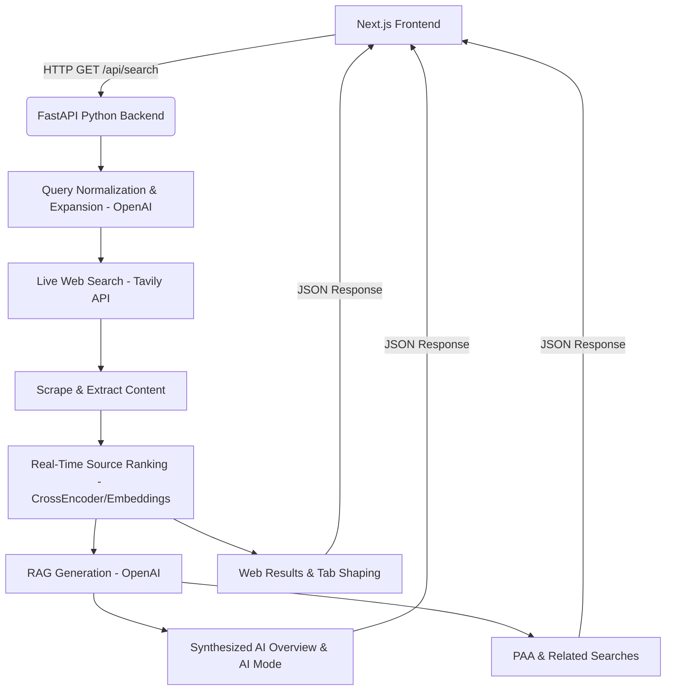

# Real-Time Python RAG Backend Migration

You're right—I gave you a TypeScript-based RAG pipeline with mock fallbacks to make it run out-of-the-box without API keys. If you want a **true production RAG pipeline**, the standard is a dedicated Python backend performing the heavy lifting. 

This plan will rip out all the mock data and replace the Next.js TypeScript pipeline with a **Real-Time Python FastAPI Backend**.

## Architecture Update

## Proposed Changes

### 1. Delete Mock Data
- Remove all `mock.ts` provider files from the Next.js app.
- Ensure the Next.js app *only* serves as a UI.

### 2. Python Backend (`/backend`)
Create a dedicated Python backend using **FastAPI**.

#### `backend/main.py`
The FastAPI application serving `/api/search`, `/api/suggest`.

#### `backend/rag_pipeline.py`
The orchestration layer that performs the complete flow exactly as your diagram shows:
1. **Query Expansion**: Uses OpenAI to generate query variants for broader search.
2. **Search Provider Fetch**: Calls Tavily API to get live result snippets.
3. **Source Ranking**: Uses `sentence-transformers` or `flashrank` in Python to rank retrieved context against the user query to find the most relevant snippets.
4. **AI Generation**: Uses `openai` python SDK to generate the Overview, Full Answer (with citations), People Also Ask, and Related Searches.

#### `backend/requirements.txt`
Dependencies: `fastapi`, `uvicorn`, `openai`, `tavily-python`, `sentence-transformers` (for real ranking), `pydantic`.

### 3. Update Next.js Frontend
- Remove `src/services/ragPipeline.ts` and `src/providers` (AI and Search logic moves to Python).
- Update the Next.js API routes (`app/api/search/route.ts`) to be simple proxies that forward the request to the Python backend running on `http://localhost:8000`.
- Keep the beautiful UI components exactly as they are—they will now consume the real Python backend response.

## User Review Required

> [!CAUTION]
> **API Keys Required**: Because we are removing all mock data, you **MUST** have an `OPENAI_API_KEY` and a `TAVILY_API_KEY` to run this. It will not work on dummy data anymore.

> [!IMPORTANT]
> **Python Environment**: You will need to install Python and run `pip install -r requirements.txt` to run the backend server alongside the Next.js server. 

Does this align with what you meant by wanting a real Python RAG pipeline instead of mock data? If you approve, I will write the Python backend and remove the JS mocks right away.
